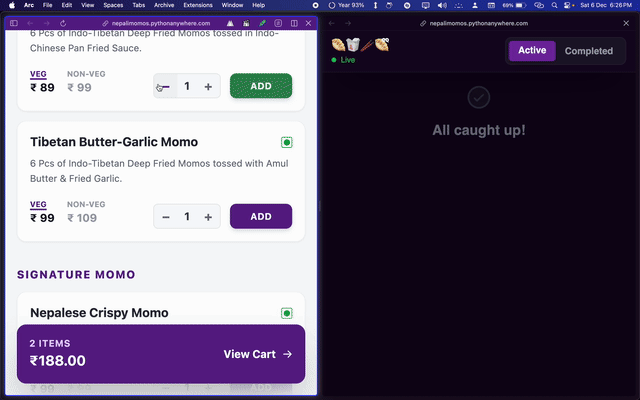

# Nepali Momo – restaurant management system 

🔗 **Live Site:** https://nepalimomos.pythonanywhere.com/  
🔐 **Admin Panel:** https://nepalimomos.pythonanywhere.com/adminmomo

---

A lightweight restaurant management system featuring a customer-facing table ordering app and a real-time Kitchen Display System (KDS). Built for simplicity using a Python/Flask backend and React front-end (via CDN).

## Tech Stack

  * **Backend:** Python (Flask), SQLite (JSON storage).
  * **Frontend:** React 18, Tailwind CSS (via CDN ).
  * **Visuals:** Phosphor Icons, Framer Motion.


## API Endpoints

  * `GET /menu.json`: Fetches menu items.
  * `POST /api/order`: Places a new order.
  * `GET /api/kitchen`: Fetches all orders for the KDS.
  * `POST /api/order/status`: Updates order status (Pending/Ready/Completed).
  * `POST /api/order/payment`: Updates payment status.

## Features

### Customer App (`index.html`)

  * **Table-Specific Ordering:** Supports query parameters (e.g., `?table=5`).
  * **Interactive Menu:** Veg/Non-veg indicators, variant selection, and quantity controls.
  * **Cart Management:** Local storage persistence and order history.
  * **Packaging:** Option to toggle "Pack this order" (calculates packaging charges).

### Kitchen Dashboard (`admin.html`)

  * **Real-Time Updates:** Auto-refreshes every 5 seconds to fetch new orders.
  * **Order Workflow:** Move orders from **Pending** → **Ready** → **Completed**.
  * **Payment Tracking:** Toggle payment status (Pending/Paid).
  * **Stats:** View live pending counts and total sales for the session.


##  Setup & Run

1.  **Prerequisites:**
    Ensure Python is installed. Install Flask and CORS:

    ```bash
    pip install flask flask-cors
    ```

2.  **File Structure:**
    Ensure your folder looks like this:

    ```text
    /project-folder
    ├── flask_app.py
    ├── index.html
    ├── admin.html
    └── static/
        ├── menu.json       # Required for the menu to load
        └── logo.png        # (Optional)
    ```

3.  **Run the Server:**

    ```bash
    python flask_app.py
    ```

    The server runs on **Port 5006**.

##  Access Links

| Role | URL | Description |
| :--- | :--- | :--- |
| **Customer** | `http://localhost:5006/` | Main ordering page. |
| **Table 5** | `http://localhost:5006/?table=5` | Simulates scanning a QR code for Table 5. |
| **Kitchen** | `http://localhost:5006/adminmomo` | Admin dashboard for kitchen staff. |
